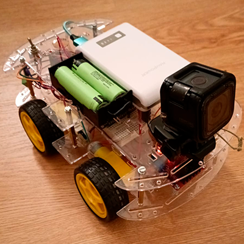
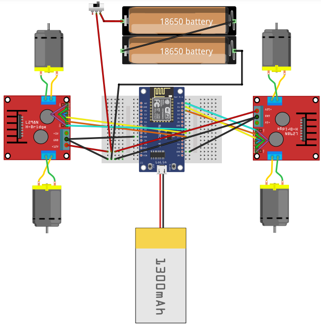

# rc-car

This project is a fully functional wireless controlled car. This repo contains:

- **CarController.ino:** Microcontroller firmware for wireless communication and motor control with PWM.
- **WirellessController.py:** Python-based controller script compatible with Xbox 360 gamepads using UDP over WiFi for real-time communication between the controller and the car

<p align="center">
  
</p>

<p align="center">
  
</p>

## Hardware
- ESP8266 microcontroller.
- 2x L298N H-bridge motor drivers.
- 4x Electric motors.
- 1x 5V Power Bank.
- Chassis and wheels.
- (Optional) Breadboard - For easier reversible connections.

The motors, chasis and wheels KIT can easily be found on Aliexpress, e.g: [DIY RC-CAR KIT](https://es.aliexpress.com/item/1005006712934485.html?spm=a2g0o.productlist.main.1.412f1mjE1mjE2x&algo_pvid=43830214-7994-41b8-adb8-a80b7354068b&algo_exp_id=43830214-7994-41b8-adb8-a80b7354068b-0&pdp_ext_f=%7B%22order%22%3A%22407%22%2C%22eval%22%3A%221%22%7D&pdp_npi=4%40dis%21EUR%2115.91%215.09%21%21%21126.27%2140.40%21%40210384b917442316554896309e3bfb%2112000038073557181%21sea%21ES%211789349058%21X&curPageLogUid=RjnNb7Gm0Gt1&utparam-url=scene%3Asearch%7Cquery_from%3A). Aswell as the [L298N bridges](https://es.aliexpress.com/item/32392774289.html?spm=a2g0o.productlist.main.3.3ab472c805P4WT&algo_pvid=fd67b3ff-6431-46b9-ab41-1693daf420d8&algo_exp_id=fd67b3ff-6431-46b9-ab41-1693daf420d8-1&pdp_ext_f=%7B%22order%22%3A%222152%22%2C%22eval%22%3A%221%22%7D&pdp_npi=4%40dis%21EUR%211.89%211.89%21%21%212.03%212.03%21%40211b618e17442318682557301ee194%2157692613834%21sea%21ES%211789349058%21X&curPageLogUid=1KLodKrAyDe7&utparam-url=scene%3Asearch%7Cquery_from%3A).


## Software
- Python 3.10.9 or later
- Pygame library (`pip install pygame`)
- Arduino IDE for programming the ESP8266

## Usage
1. Configure your WiFi credentials in the code (`WIFI_SSID` and `WIFI_PASS`).
2. Flash the `CarController.ino` code to the ESP8266 using the Arduino IDE.
3. Run the `WirelessController.py`:
    ```bash
    python WirelessController.py
    ```

## How It Works
- The ESP8266 connects to a WiFi network and listens for UDP packets.
- The Python script initializes the gamepad and establishes a UDP connection sending packets to a port on the same WiFi.
- The gamepad inputs (joystick and buttons) are processed by the Python script.
- Encoded commands are sent / received by the ESP8266.
- The ESP8266 decodes the packets and adjusts motor speeds and directions accordingly.